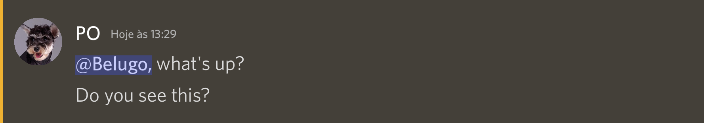
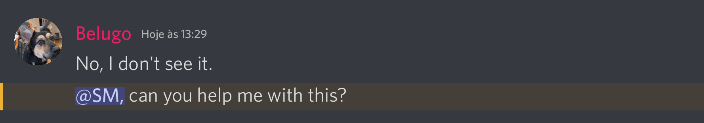
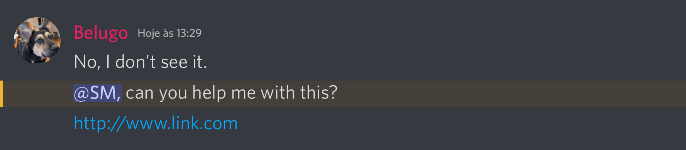
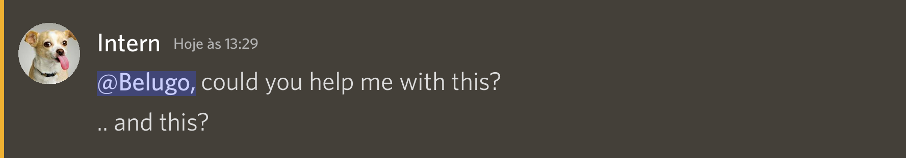
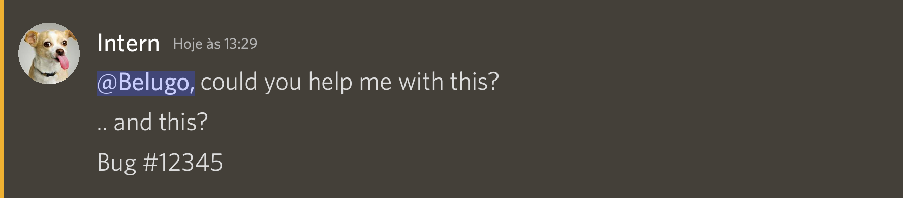

# Discord Chat Generator in Python

This Python script serves as a Discord chat generator, creating visual representations of chat conversations in a graphical format. It leverages the Pillow library for image manipulation and MoviePy for video clip creation. The script is specifically tailored for generating visual Discord chat representations, ideal for presentations or videos.

## Install

To install the required libraries, run the following command:

```
pip install -r requirements.txt
```

## Usage

### Basic Usage
To generate images from a Discord chat log file:
```
python discord_gen.py -i input/example.txt -c
```
Results will be saved in the `output` folder.

> The optional `-c` flag can be used to clear the output folder before generating images.


### Generate movie clip
To generate a movie clip from a Discord chat log file:
```
python discord_gen.py -i input/example.txt -c -m
```
Results will be saved in the `output` folder.

## Basic Concepts

### Input chat file


message -->display time (in seconds)

@mentions

[image:image_name.png] 

[url:http://www.link.com]

\# comments

### File example


``````
:Manager:
@Belugo, what's up? -->0.5

:Belugo:
I'm having car problems.
[image:car.png] -->3
I'm going to be late for work today. 

:Manager:
No problem, take your time. --> 1

:Belugo:
Thanks! --> 0.5

# comments
# comments

:PO:
@Belugo, what's up? -->0.5
Do you see this?
[url:http://www.link.com]

:Belugo:
No, I don't see it. --> 2
@SM, can you help me with this?
[url:http://www.link.com]

:Intern:
@Belugo, could you help me with this?
.. and this?
Bug #12345 --> 5

# comments
``````

### Output images











### Output movie clip


## License

This project is licensed under the MIT License.


## Support


<a href="https://www.buymeacoffee.com/eupassarin" target="_blank"></a>


